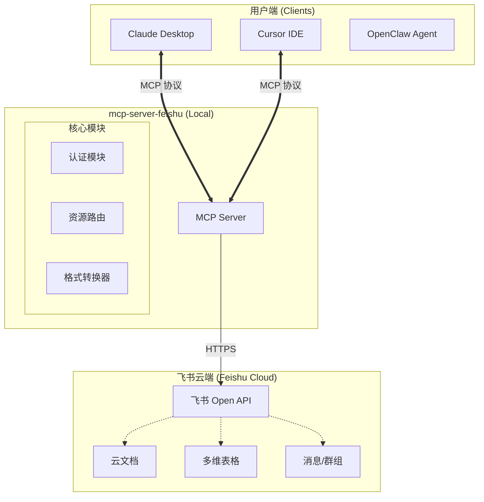

# mcp-server-feishu

<div align="center">


**让 Claude / DeepSeek / Cursor 读懂你的飞书文档**

[English](./README_EN.md) | [简体中文](./README.md)

</div>

---

> 🚧 **Work In Progress**: 本项目正在紧锣密鼓开发中，欢迎 Star 关注最新进展！

## 🌟 简介

`mcp-server-feishu` 是一个基于 [Model Context Protocol (MCP)](https://modelcontextprotocol.io) 的飞书（Lark）连接器。

它打通了 **AI 大模型**（Claude, DeepSeek）与 **飞书办公套件** 之间的壁垒，让你可以直接在 Cursor、Claude Desktop 等工具中：

- 📖 **读取** 飞书云文档、多维表格
- 🔍 **查询** 企业通讯录、日历忙闲
- 📤 **发送** 消息通知、审批请求

不做数据的搬运工，只做智能的连接器。

## 🏗️ 架构图



## ✨ 核心功能 (规划中)

| 功能模块 | 描述 | 进度 |
|---------|------|------|
| **Doc Reader** | 读取飞书文档，转换为 Markdown 喂给 AI | 🚧 开发中 |
| **Wiki Search** | 搜索企业知识库 | 📅 计划中 |
| **Base SQL** | 用自然语言查询多维表格数据 | 📅 计划中 |
| **Bot Sender** | 通过机器人发送群消息/个人通知 | 📅 计划中 |

## 🚀 快速开始

*(开发完成后更新)*

```bash
# 安装
pip install mcp-server-feishu

# 运行
export FEISHU_APP_ID="your_app_id"
export FEISHU_APP_SECRET="your_app_secret"
mcp-server-feishu
```

## 🤝 贡献与交流

欢迎提交 Issue 或 PR！

关注作者公众号，获取最新开发动态和实战教程：


